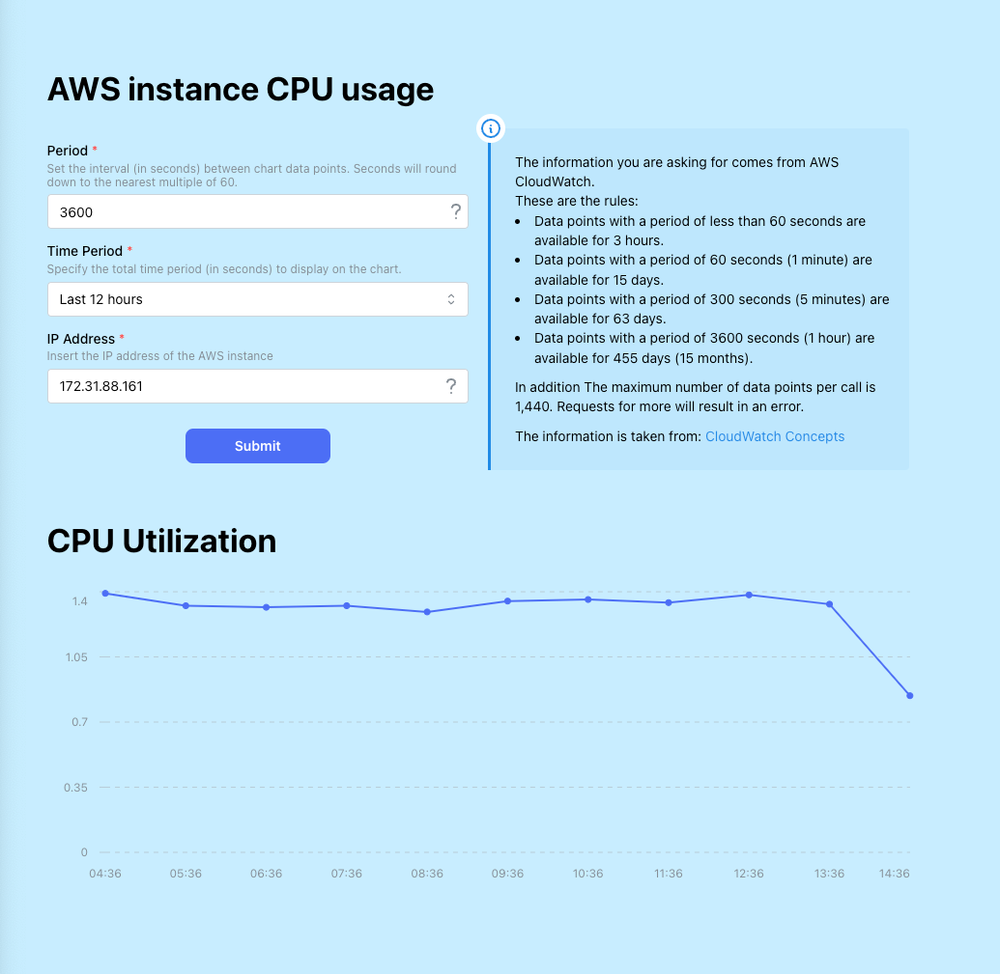

# Welcome to faddomm-front project

This project visualizes CPU utilization of AWS EC2 instances through a line graph. The graph is generated by querying
AWS for three key parameters:

- Period: The time interval between data points on the graph.
- Time Range: The total time span to display on the graph.
- Instance IP Address: The IP address of the EC2 instance.

## Steps for activate the project:

1. Install the required dependencies by running: `npm install`
2. Start the project with: `npm run start`

Once the project is running, open http://localhost:3000 in your browser to view the application.

## Example of the Project in Action:

Here’s a screenshot of the project at work:

